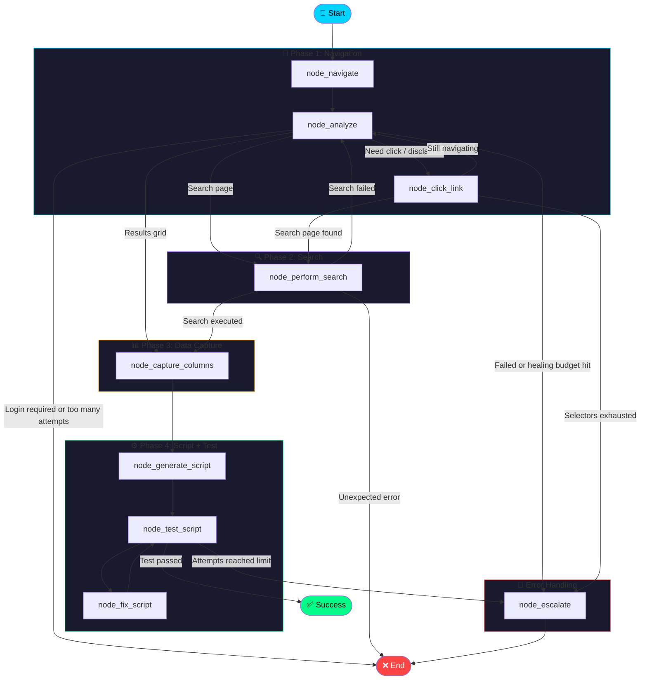

# Deep Scraper Agent - Workflow Documentation

This document describes the LangGraph-based agent workflow for autonomous web scraping and Playwright script generation.

## Architecture Overview

The agent uses a **single-layer MCP architecture**:

| Layer | Tool | Purpose |
|-------|------|---------|
| 🎭 **Browser Layer** | Playwright MCP | Navigate, click, fill, snapshot — all actions |
| 🧠 **Intelligence Layer** | Gemini LLM | Classify pages, generate scripts, fix errors |

> Both the agent session and the generated scripts use Playwright exclusively. The LLM receives cleaned HTML snapshots from MCP for all analysis decisions.

## Workflow Diagram

```mermaid
flowchart TD
    START([🚀 Start]) --> NAV

    subgraph P1["📍 Phase 1: Navigation"]
        direction TB
        NAV["node_navigate"] --> ANA["node_analyze"]
        CLK["node_click_link"]
    end

    subgraph P2["🔍 Phase 2: Search"]
        direction TB
        SRCH["node_perform_search"]
    end

    subgraph P3["📊 Phase 3: Data Capture"]
        direction TB
        CAP["node_capture_columns"]
    end

    subgraph P4["⚙️ Phase 4: Script + Test"]
        direction TB
        GEN["node_generate_script"] --> TST["node_test_script"]
        FIX["node_fix_script"]
    end

    subgraph P5["🚨 Error Handling"]
        direction TB
        ESC["node_escalate"]
    end

    ANA -->|Search page| SRCH
    ANA -->|Results grid| CAP
    ANA -->|Need click / disclaimer| CLK
    ANA -->|Login required or too many attempts| END_FAIL
    ANA -->|Failed or healing budget hit| ESC

    CLK -->|Still navigating| ANA
    CLK -->|Search page found| SRCH
    CLK -->|Selectors exhausted| ESC

    SRCH -->|Search executed| CAP
    SRCH -->|Search failed| ANA
    SRCH -->|Unexpected error| END_FAIL

    CAP --> GEN

    TST -->|Test passed| END_SUCCESS
    TST --> FIX
    TST -->|Attempts reached limit| ESC
    FIX --> TST

    ESC --> END_FAIL

    END_SUCCESS([✅ Success])
    END_FAIL([❌ End])

    style START fill:#00d4ff,color:#000
    style END_SUCCESS fill:#00ff88,color:#000
    style END_FAIL fill:#ff4444,color:#fff
    style P1 fill:#1a1a2e,stroke:#00d4ff
    style P2 fill:#1a1a2e,stroke:#7c3aed
    style P3 fill:#1a1a2e,stroke:#ffaa00
    style P4 fill:#1a1a2e,stroke:#00ff88
    style P5 fill:#1a1a2e,stroke:#ff4444
```

## Node Descriptions

| Node | File | Purpose |
|------|------|---------|
| `node_navigate` | `nodes/navigation.py` | `goto()` via MCP, start codegen session, increment `attempt_count` |
| `node_analyze` | `nodes/navigation.py` | MCP snapshot → clean HTML → LLM structured output → classify page type |
| `node_click_link` | `nodes/disclaimer.py` | Click accept/disclaimer/portal icon; post-click LLM analysis; Landmark Web modal detection |
| `node_perform_search` | `nodes/search.py` | Fill name + dates (datepicker/JS/standard strategies), submit, handle popups |
| `node_capture_columns` | `nodes/extraction.py` | JS visibility filter on tables, HTML → LLM → grid selector + column list |
| `node_generate_script` | `nodes/script_gen.py` | Build prompt from recorded steps → LLM generates Playwright `.py` file |
| `node_test_script` | `nodes/script_test.py` | `subprocess.run` the script; verify `SUCCESS` + positive row count in stdout |
| `node_fix_script` | `nodes/script_test.py` | LLM receives script + error → rewrites and saves fixed version |
| `node_escalate` | `nodes/script_test.py` | Sets `NEEDS_HUMAN_REVIEW`; terminal node → END |

## Routing Logic (Conditional Edges)

### After `analyze` → `should_search_or_click()`
| Condition | Next Node |
|-----------|-----------|
| `attempt_count > 5` | END |
| `disclaimer_click_attempts >= 5` | `escalate` |
| `status == FAILED` | `escalate` |
| `status == LOGIN_REQUIRED` | END |
| `healing_attempts >= 2` | `escalate` |
| `status == RESULTS_GRID_FOUND` | `capture_columns` |
| `status == SEARCH_PAGE_FOUND` | `perform_search` |
| anything else | `click_link` |

### After `perform_search` → `check_search_status()`
| Condition | Next Node |
|-----------|-----------|
| `status == SEARCH_EXECUTED` | `capture_columns` |
| `status == FAILED` | `analyze` (re-examine page) |
| anything else | END |

### After `test_script` → `check_test_result()`
| Condition | Next Node |
|-----------|-----------|
| `status == SCRIPT_TESTED` | END (success) |
| `script_test_attempts >= 3` | `escalate` |
| `status == SCRIPT_FAILED / SCRIPT_ERROR` | `fix_script` |
| anything else | END |

### Fixed edges
- `navigate → analyze`
- `click_link → analyze` *(unless `SEARCH_PAGE_FOUND` or `FAILED` — those are conditional)*
- `capture_columns → generate_script`
- `generate_script → test_script`
- `fix_script → test_script`
- `escalate → END`

## State Variables

| Field | Type | Purpose |
|-------|------|---------|
| `target_url` | str | Starting URL |
| `search_query` | str | Search term |
| `start_date` / `end_date` | str | Date range (MM/DD/YYYY) |
| `attempt_count` | int | Navigation attempts (circuit breaker at > 5) |
| `disclaimer_click_attempts` | int | Click attempts (circuit breaker at ≥ 5) |
| `clicked_selectors` | List[str] | Previously tried selectors (dedup) |
| `healing_attempts` | int | AI self-healing budget (circuit breaker at ≥ 2) |
| `recorded_steps` | List[Dict] | All browser actions recorded for script generation |
| `search_selectors` | Dict | `input`, `submit`, `start_date`, `end_date`, `grid` selectors |
| `column_mapping` | Dict | `col_0..N` → visible column name |
| `discovered_grid_selectors` | List[str] | CSS selectors confirmed in the DOM |
| `grid_html` | str | Filtered HTML fragment of the results grid |
| `first_data_column_index` | int | Index of first real data column (skip row#/icons) |
| `generated_script_path` | str | Absolute path to the saved `.py` script |
| `generated_script_code` | str | Raw source of the generated script |
| `script_test_attempts` | int | Test/fix iterations |
| `script_error` | str | Last error from test run |
| `site_type` | str | `ACCLAIMWEB` / `INFRAGISTICS` / `LANDMARK_WEB` / `UNKNOWN` |
| `needs_human_review` | bool | Set by `node_escalate` |

## Timeouts

| Location | Timeout | Purpose |
|----------|---------|---------|
| MCP browser actions | varies (MCP default) | Page loads, clicks, snapshots |
| Script test subprocess | `SCRIPT_TEST_TIMEOUT_SECONDS` (constants) | Hard cap on generated script execution |
| Post-click analysis sleep | 3s | Allow page to settle after click |
