# Deep Scraper Agent - Workflow Documentation

This document describes the LangGraph-based agent workflow for autonomous web scraping and Playwright script generation.

## Architecture Overview

The agent uses a **dual-layer architecture**:

| Layer | Tool | Purpose |
|-------|------|---------|
| 🔥 **Vision Layer** | Firecrawl SDK | Convert pages to clean Markdown for LLM analysis |
| 🎭 **Action Layer** | Playwright | Click, fill, navigate, and interact with pages |

> **Note**: Firecrawl is used during agent execution for smarter analysis. Generated scripts use only Playwright (no external dependencies).

## Workflow Diagram

### Mermaid Source (for editing)

```mermaid
flowchart TD
    START([🚀 START]) --> navigate

    subgraph NAVIGATION["📍 Phase 1: Navigation"]
        navigate["node_navigate<br/>Playwright: goto()"]
        analyze["node_analyze<br/>🔥 Firecrawl → Markdown<br/>LLM: Classify Page"]
        click_link["node_click_link<br/>Playwright: click()"]
    end

    subgraph SEARCH["🔍 Phase 2: Search"]
        perform_search["node_perform_search<br/>Fill Form & Submit"]
    end

    subgraph CAPTURE["📊 Phase 3: Data Capture"]
        capture_columns["node_capture_columns<br/>Identify Grid & Columns"]
    end

    subgraph SCRIPT["⚙️ Phase 4: Script Generation"]
        generate_script["node_generate_script<br/>Generate Playwright Script"]
        test_script["node_test_script<br/>Execute & Validate"]
        fix_script["node_fix_script<br/>AI-Powered Fix"]
    end

    subgraph ERROR["🚨 Error Handling"]
        escalate["node_escalate<br/>Human Intervention"]
    end

    navigate --> analyze
    
    analyze -->|"Search Page"| perform_search
    analyze -->|"Disclaimer"| click_link
    analyze -->|"Login Required"| END_FAIL
    analyze -->|"Healing Exceeded"| escalate
    
    click_link --> navigate
    
    perform_search -->|"Success"| capture_columns
    perform_search -->|"Failed"| escalate
    
    capture_columns --> generate_script
    generate_script --> test_script
    
    test_script -->|"✅ Pass"| END_SUCCESS
    test_script -->|"❌ Fail (< 3)"| fix_script
    test_script -->|"❌ Max Retries"| END_FAIL
    
    fix_script --> test_script
    escalate --> END_FAIL

    END_SUCCESS([✅ SUCCESS<br/>Script Ready])
    END_FAIL([❌ END])

    style START fill:#00d4ff,color:#000
    style END_SUCCESS fill:#00ff88,color:#000
    style END_FAIL fill:#ff4444,color:#fff
    style NAVIGATION fill:#1a1a2e,stroke:#00d4ff
    style SEARCH fill:#1a1a2e,stroke:#7c3aed
    style CAPTURE fill:#1a1a2e,stroke:#ffaa00
    style SCRIPT fill:#1a1a2e,stroke:#00ff88
    style ERROR fill:#1a1a2e,stroke:#ff4444
```

## Node Descriptions

| Node | Vision Layer | Action Layer | Purpose |
|------|--------------|--------------|---------|
| `node_navigate` | - | Playwright `goto()` | Navigate to URL, record step |
| `node_analyze` | 🔥 **Firecrawl** → Markdown | - | LLM classifies page type |
| `node_click_link` | - | Playwright `click()` | Accept disclaimer, navigate |
| `node_perform_search` | - | Playwright `fill()`, `click()` | Execute search |
| `node_capture_columns` | Firecrawl Markdown | - | Detect grid columns |
| `node_generate_script` | - | - | LLM generates Playwright code |
| `node_test_script` | - | Subprocess | Run generated script |
| `node_fix_script` | - | - | LLM fixes errors |

## Firecrawl Integration

In `node_analyze`, the agent:

1. Checks for `FIRECRAWL_API_KEY` environment variable
2. If found, calls `firecrawl.scrape(url, formats=['markdown'])`
3. Passes clean Markdown to LLM instead of raw HTML
4. Falls back to Playwright text extraction if API unavailable

**Benefits:**
- 🎯 Higher accuracy in page classification
- 📉 Lower token cost (Markdown is 90% smaller than HTML)
- 🔍 Better structure detection (tables, forms, links)

## State Variables

| Field | Type | Purpose |
|-------|------|---------|
| `target_url` | str | Starting URL |
| `search_query` | str | Search term |
| `firecrawl_markdown` | str | Cached Markdown from Firecrawl |
| `recorded_steps` | List[Dict] | Actions for script generation |
| `column_mapping` | Dict | Grid column → field name mapping |
| `generated_script_path` | str | Path to generated .py file |

## Timeouts

| Location | Timeout | Purpose |
|----------|---------|---------|
| Browser actions | 2000ms | Page loads, clicks |
| Generated scripts | 6000ms | wait_for_selector calls |
| Script test | 120s | Subprocess execution limit |
